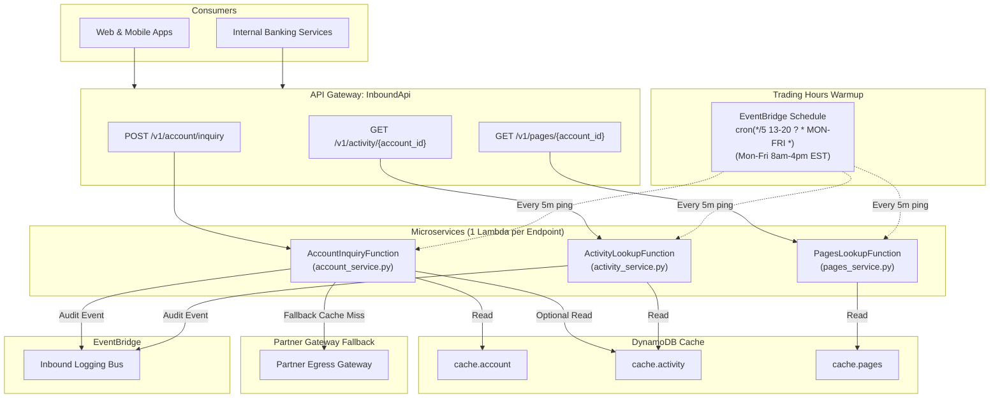

# Core Data API — Architecture Diagram

```mermaid
flowchart TD
    subgraph Clients["Consumers"]
        WEB["Web & Mobile Apps"]
        INTERNAL["Internal Banking Services"]
    end

    subgraph Warmup["Trading Hours Warmup"]
        RULE["EventBridge Schedule\ncron(*/5 13-20 ? * MON-FRI *)\n(Mon-Fri 8am-4pm EST)"]
    end

    subgraph ApiGateway["API Gateway: InboundApi"]
        R1["POST /v1/account/inquiry"]
        R2["GET /v1/activity/{account_id}"]
        R3["GET /v1/pages/{account_id}"]
    end

    subgraph Lambdas["Microservices (1 Lambda per Endpoint)"]
        F1["AccountInquiryFunction\n(account_service.py)"]
        F2["ActivityLookupFunction\n(activity_service.py)"]
        F3["PagesLookupFunction\n(pages_service.py)"]
    end

    subgraph Storage["DynamoDB Cache"]
        T1["cache.account"]
        T2["cache.activity"]
        T3["cache.pages"]
    end

    subgraph Egress["Partner Gateway Fallback"]
        GW["Partner Egress Gateway"]
    end

    subgraph Auditing["EventBridge"]
        BUS["Inbound Logging Bus"]
    end

    WEB --> ApiGateway
    INTERNAL --> ApiGateway

    R1 --> F1
    R2 --> F2
    R3 --> F3

    RULE -.->|"Every 5m ping"| F1
    RULE -.->|"Every 5m ping"| F2
    RULE -.->|"Every 5m ping"| F3

    F1 -->|"Read"| T1
    F1 -->|"Optional Read"| T2
    F1 -->|"Fallback Cache Miss"| GW
    F1 -->|"Audit Event"| BUS

    F2 -->|"Read"| T2
    F2 -->|"Audit Event"| BUS

    F3 -->|"Read"| T3
```
