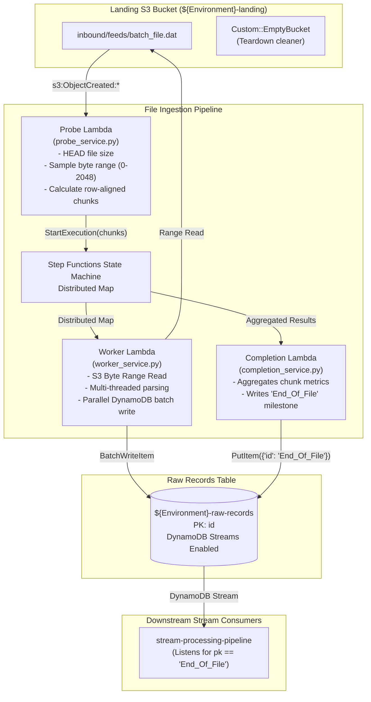

# Batch File Ingestion Pipeline — Architecture Diagram

```mermaid
flowchart TD
    subgraph S3["Landing S3 Bucket (${Environment}-landing)"]
        FEED["inbound/feeds/batch_file.dat"]
        EMPTY["Custom::EmptyBucket\n(Teardown cleaner)"]
    end

    subgraph Ingestion["File Ingestion Pipeline"]
        PROBE["Probe Lambda\n(probe_service.py)\n- HEAD file size\n- Sample byte range (0-2048)\n- Calculate row-aligned chunks"]
        SFN["Step Functions State Machine\nDistributed Map"]
        WORKER["Worker Lambda\n(worker_service.py)\n- S3 Byte Range Read\n- Multi-threaded parsing\n- Parallel DynamoDB batch write"]
        COMPLETION["Completion Lambda\n(completion_service.py)\n- Aggregates chunk metrics\n- Writes 'End_Of_File' milestone"]
    end

    subgraph Storage["Raw Records Table"]
        TARGET[("${Environment}-raw-records\nPK: id\nDynamoDB Streams Enabled")]
    end

    subgraph Downstream["Downstream Stream Consumers"]
        STREAM["stream-processing-pipeline\n(Listens for pk == 'End_Of_File')"]
    end

    FEED -->|"s3:ObjectCreated:*"| PROBE
    PROBE -->|"StartExecution(chunks)"| SFN
    SFN -->|"Distributed Map"| WORKER
    WORKER -->|"Range Read"| FEED
    WORKER -->|"BatchWriteItem"| TARGET
    SFN -->|"Aggregated Results"| COMPLETION
    COMPLETION -->|"PutItem({'id': 'End_Of_File'})"| TARGET
    TARGET -->|"DynamoDB Stream"| STREAM
```
