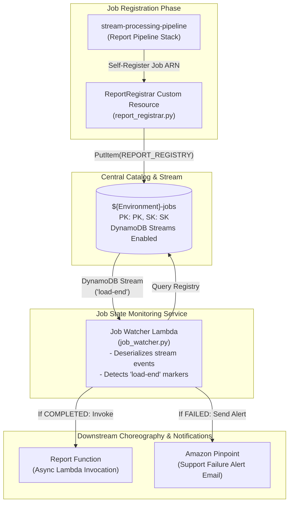

# Job Service — Architecture Diagram

```mermaid
flowchart TD
    subgraph Registration["Job Registration Phase"]
        REPORT_STACK["stream-processing-pipeline\n(Report Pipeline Stack)"]
        REGISTRAR["ReportRegistrar Custom Resource\n(report_registrar.py)"]
    end

    subgraph Storage["Central Catalog & Stream"]
        JOBS_TABLE[("${Environment}-jobs\nPK: PK, SK: SK\nDynamoDB Streams Enabled")]
    end

    subgraph Watcher["Job State Monitoring Service"]
        JOB_WATCHER["Job Watcher Lambda\n(job_watcher.py)\n- Deserializes stream events\n- Detects 'load-end' markers"]
    end

    subgraph Execution["Downstream Choreography & Notifications"]
        REPORT_LAMBDA["Report Function\n(Async Lambda Invocation)"]
        PINPOINT["Amazon Pinpoint\n(Support Failure Alert Email)"]
    end

    REPORT_STACK -->|"Self-Register Job ARN"| REGISTRAR
    REGISTRAR -->|"PutItem(REPORT_REGISTRY)"| JOBS_TABLE

    JOBS_TABLE -->|"DynamoDB Stream\n('load-end')"| JOB_WATCHER
    JOB_WATCHER -->|"Query Registry"| JOBS_TABLE
    JOB_WATCHER -->|"If COMPLETED: Invoke"| REPORT_LAMBDA
    JOB_WATCHER -->|"If FAILED: Send Alert"| PINPOINT
```
