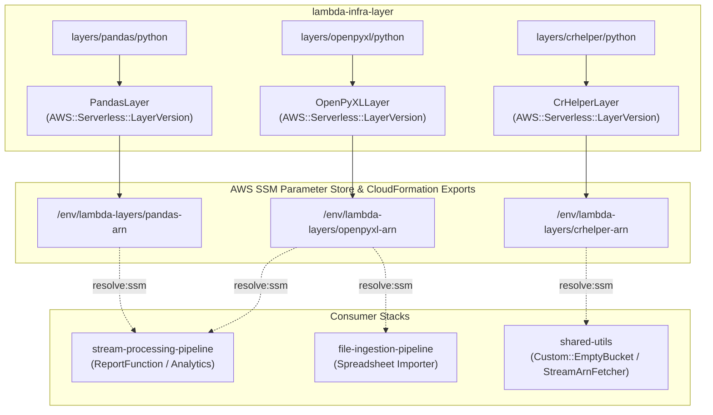
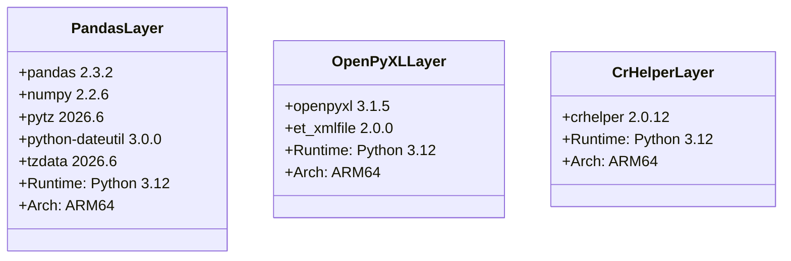

# Lambda Infrastructure Layers — Architecture & Integration

## 1. Layer Publishing & Cross-Stack Distribution

```mermaid
flowchart TD
    subgraph Repo[lambda-infra-layer]
        P_SRC["layers/pandas/python"]
        O_SRC["layers/openpyxl/python"]
        C_SRC["layers/crhelper/python"]

        P_LAYER["PandasLayer\n(AWS::Serverless::LayerVersion)"]
        O_LAYER["OpenPyXLLayer\n(AWS::Serverless::LayerVersion)"]
        C_LAYER["CrHelperLayer\n(AWS::Serverless::LayerVersion)"]

        P_SRC --> P_LAYER
        O_SRC --> O_LAYER
        C_SRC --> C_LAYER
    end

    subgraph Config[AWS SSM Parameter Store & CloudFormation Exports]
        SSM_P["/env/lambda-layers/pandas-arn"]
        SSM_O["/env/lambda-layers/openpyxl-arn"]
        SSM_C["/env/lambda-layers/crhelper-arn"]

        P_LAYER --> SSM_P
        O_LAYER --> SSM_O
        C_LAYER --> SSM_C
    end

    subgraph Consumers[Consumer Stacks]
        F1["stream-processing-pipeline\n(ReportFunction / Analytics)"]
        F2["file-ingestion-pipeline\n(Spreadsheet Importer)"]
        F3["shared-utils\n(Custom::EmptyBucket / StreamArnFetcher)"]

        SSM_P -.->|resolve:ssm| F1
        SSM_O -.->|resolve:ssm| F1
        SSM_O -.->|resolve:ssm| F2
        SSM_C -.->|resolve:ssm| F3
    end
```

## 2. Layer Specifications

```mermaid
classDiagram
    class PandasLayer {
        +pandas 2.3.2
        +numpy 2.2.6
        +pytz 2026.6
        +python-dateutil 3.0.0
        +tzdata 2026.6
        +Runtime: Python 3.12
        +Arch: ARM64
    }

    class OpenPyXLLayer {
        +openpyxl 3.1.5
        +et_xmlfile 2.0.0
        +Runtime: Python 3.12
        +Arch: ARM64
    }

    class CrHelperLayer {
        +crhelper 2.0.12
        +Runtime: Python 3.12
        +Arch: ARM64
    }
```
