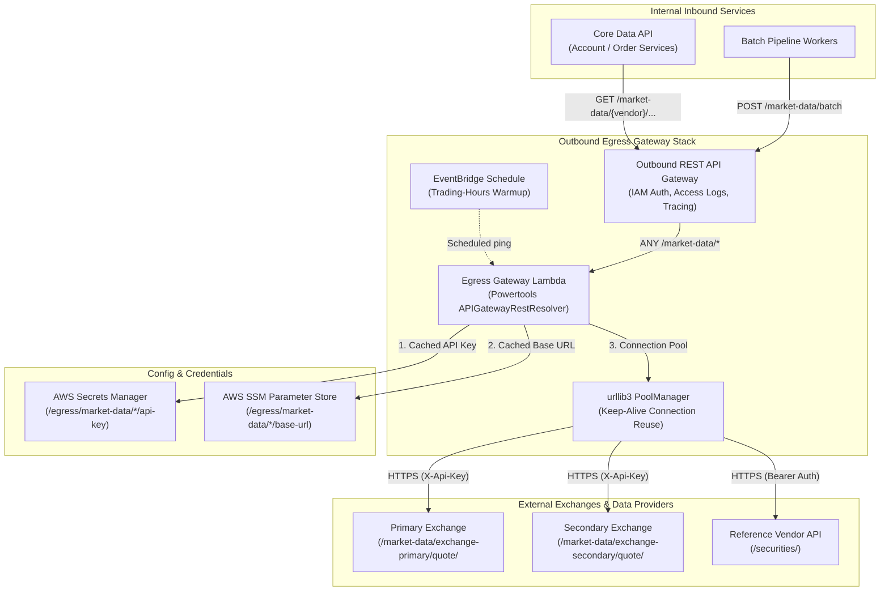

# Financial Market Data Egress Gateway — Architecture Diagram

```mermaid
flowchart TD
    subgraph InternalCallers["Internal Inbound Services"]
        CORE["Core Data API\n(Account / Order Services)"]
        BATCH["Batch Pipeline Workers"]
    end

    subgraph EgressFaçade["Outbound Egress Gateway Stack"]
        APIGW["Outbound REST API Gateway\n(IAM Auth, Access Logs, Tracing)"]
        LAMBDA["Egress Gateway Lambda\n(Powertools APIGatewayRestResolver)"]
        WARMUP["EventBridge Schedule\n(Trading-Hours Warmup)"]
        POOL["urllib3 PoolManager\n(Keep-Alive Connection Reuse)"]
    end

    subgraph ConfigAndSecurity["Config & Credentials"]
        SM["AWS Secrets Manager\n(/egress/market-data/*/api-key)"]
        SSM["AWS SSM Parameter Store\n(/egress/market-data/*/base-url)"]
    end

    subgraph ExternalVendors["External Exchanges & Data Providers"]
        EXCH_A["Primary Exchange\n(/market-data/exchange-primary/quote/<symbol>)"]
        EXCH_B["Secondary Exchange\n(/market-data/exchange-secondary/quote/<symbol>)"]
        REF["Reference Vendor API\n(/securities/<identifier>)"]
    end

    CORE -->|"GET /market-data/{vendor}/..."| APIGW
    BATCH -->|"POST /market-data/batch"| APIGW
    WARMUP -.->|"Scheduled ping"| LAMBDA
    APIGW -->|"ANY /market-data/*"| LAMBDA

    LAMBDA -->|"1. Cached API Key"| SM
    LAMBDA -->|"2. Cached Base URL"| SSM
    LAMBDA -->|"3. Connection Pool"| POOL

    POOL -->|"HTTPS (X-Api-Key)"| EXCH_A
    POOL -->|"HTTPS (X-Api-Key)"| EXCH_B
    POOL -->|"HTTPS (Bearer Auth)"| REF
```
