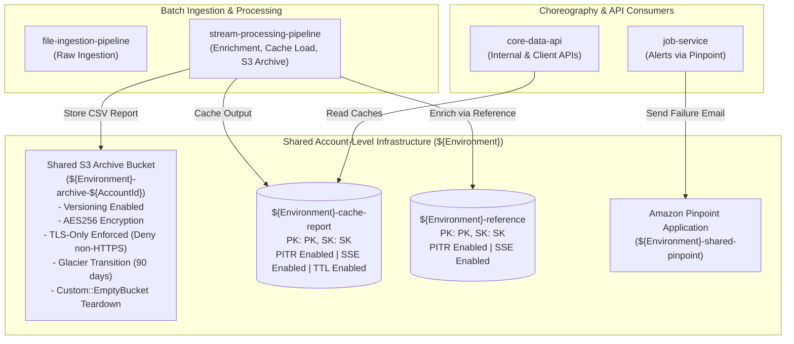

# Shared Infrastructure — Architecture Diagram

```mermaid
flowchart TD
    subgraph Storage["Shared Account-Level Infrastructure (${Environment})"]
        ARCHIVE["Shared S3 Archive Bucket\n(${Environment}-archive-${AccountId})\n- Versioning Enabled\n- AES256 Encryption\n- TLS-Only Enforced (Deny non-HTTPS)\n- Glacier Transition (90 days)\n- Custom::EmptyBucket Teardown"]

        CACHE_TABLE[("${Environment}-cache-report\nPK: PK, SK: SK\nPITR Enabled | SSE Enabled | TTL Enabled")]
        REF_TABLE[("${Environment}-reference\nPK: PK, SK: SK\nPITR Enabled | SSE Enabled")]
        PINPOINT["Amazon Pinpoint Application\n(${Environment}-shared-pinpoint)"]
    end

    subgraph Ingestion["Batch Ingestion & Processing"]
        INGEST["file-ingestion-pipeline\n(Raw Ingestion)"]
        STREAM["stream-processing-pipeline\n(Enrichment, Cache Load, S3 Archive)"]
    end

    subgraph ConsumerServices["Choreography & API Consumers"]
        JOBS["job-service\n(Alerts via Pinpoint)"]
        CORE_API["core-data-api\n(Internal & Client APIs)"]
    end

    STREAM -->|"Enrich via Reference"| REF_TABLE
    STREAM -->|"Cache Output"| CACHE_TABLE
    STREAM -->|"Store CSV Report"| ARCHIVE
    JOBS -->|"Send Failure Email"| PINPOINT
    CORE_API -->|"Read Caches"| CACHE_TABLE
```
