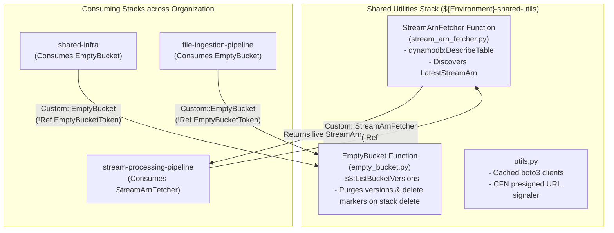

# Shared Utilities — Architecture Diagram

```mermaid
flowchart TD
    subgraph SharedUtils["Shared Utilities Stack (${Environment}-shared-utils)"]
        SAF_FN["StreamArnFetcher Function\n(stream_arn_fetcher.py)\n- dynamodb:DescribeTable\n- Discovers LatestStreamArn"]
        EB_FN["EmptyBucket Function\n(empty_bucket.py)\n- s3:ListBucketVersions\n- Purges versions & delete markers on stack delete"]
        UTILS["utils.py\n- Cached boto3 clients\n- CFN presigned URL signaler"]
    end

    subgraph ConsumingStacks["Consuming Stacks across Organization"]
        STREAM_STACK["stream-processing-pipeline\n(Consumes StreamArnFetcher)"]
        INFRA_STACK["shared-infra\n(Consumes EmptyBucket)"]
        INGEST_STACK["file-ingestion-pipeline\n(Consumes EmptyBucket)"]
    end

    STREAM_STACK -->|"Custom::StreamArnFetcher\n(!Ref StreamArnFetcherToken)"| SAF_FN
    SAF_FN -->|"Returns live StreamArn"| STREAM_STACK

    INFRA_STACK -->|"Custom::EmptyBucket\n(!Ref EmptyBucketToken)"| EB_FN
    INGEST_STACK -->|"Custom::EmptyBucket\n(!Ref EmptyBucketToken)"| EB_FN
```
