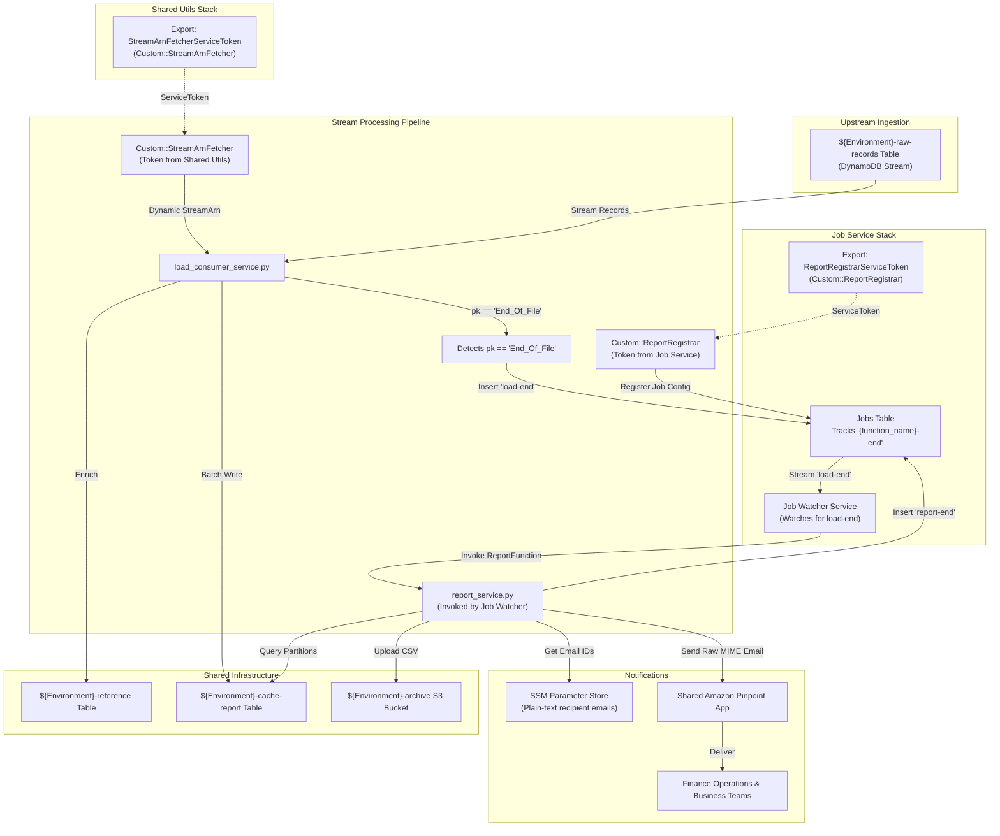

# Stream Processing Pipeline — Architecture Diagram

```mermaid
flowchart TD
    subgraph Upstream["Upstream Ingestion"]
        RAW["${Environment}-raw-records Table\n(DynamoDB Stream)"]
    end

    subgraph SharedUtils["Shared Utils Stack"]
        SAF_Token["Export: StreamArnFetcherServiceToken\n(Custom::StreamArnFetcher)"]
    end

    subgraph JobService["Job Service Stack"]
        JT["Jobs Table\nTracks '{function_name}-end'"]
        RR_Token["Export: ReportRegistrarServiceToken\n(Custom::ReportRegistrar)"]
        JW["Job Watcher Service\n(Watches for load-end)"]
    end

    subgraph Pipeline["Stream Processing Pipeline"]
        SAF["Custom::StreamArnFetcher\n(Token from Shared Utils)"]
        LF["load_consumer_service.py"]
        EOF["Detects pk == 'End_Of_File'"]
        RF["report_service.py\n(Invoked by Job Watcher)"]
        RR["Custom::ReportRegistrar\n(Token from Job Service)"]
    end

    subgraph SharedInfra["Shared Infrastructure"]
        CR["${Environment}-cache-report Table"]
        RT["${Environment}-reference Table"]
        S3["${Environment}-archive S3 Bucket"]
    end

    subgraph Messaging["Notifications"]
        SSM["SSM Parameter Store\n(Plain-text recipient emails)"]
        PP["Shared Amazon Pinpoint App"]
        TEAMS["Finance Operations & Business Teams"]
    end

    SAF_Token -.->|"ServiceToken"| SAF
    SAF -->|"Dynamic StreamArn"| LF
    RAW -->|"Stream Records"| LF
    LF -->|"Enrich"| RT
    LF -->|"Batch Write"| CR
    LF -->|"pk == 'End_Of_File'"| EOF
    EOF -->|"Insert 'load-end'"| JT

    RR_Token -.->|"ServiceToken"| RR
    RR -->|"Register Job Config"| JT

    JT -->|"Stream 'load-end'"| JW
    JW -->|"Invoke ReportFunction"| RF

    RF -->|"Query Partitions"| CR
    RF -->|"Upload CSV"| S3
    RF -->|"Get Email IDs"| SSM
    RF -->|"Send Raw MIME Email"| PP
    PP -->|"Deliver"| TEAMS
    RF -->|"Insert 'report-end'"| JT
```
